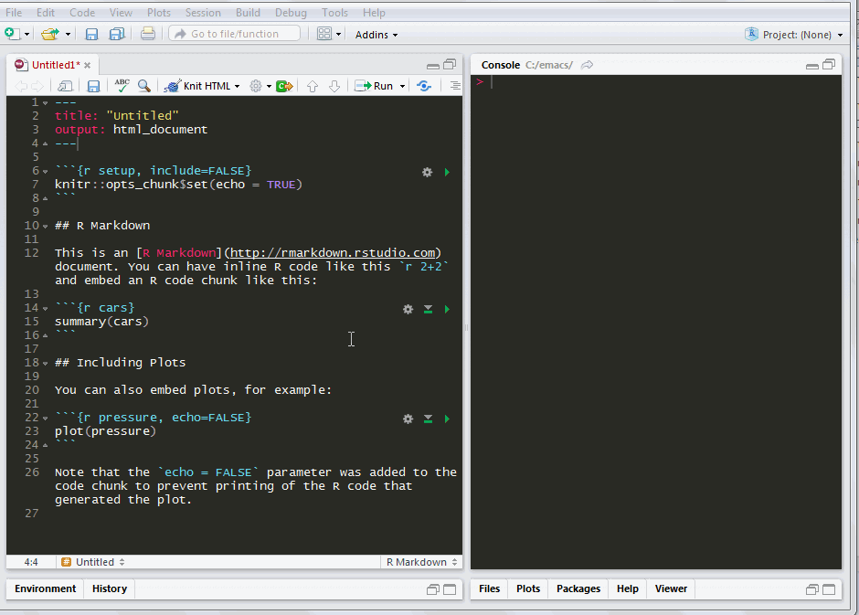

<!-- README.md is generated from README.Rmd. Please edit that file -->
wordcountaddin
==============

This R package is an [RStudio addin](https://rstudio.github.io/rstudioaddins/) to count words and characters in selected text in an [R markdown](http://rmarkdown.rstudio.com/) document. It also has a function to compute readability statistics.

When counting words in the text of your Rmd document, these things will be ignored:

-   YAML front matter
-   code chunks and inline code
-   text in HTML comment tags: `<!-- text -->`
-   inline URLs in this format: `[text of link](url)`
-   images with captions in this format: ``
-   header level indicators such as `#` and `##`, etc.

And because my regex is quite simple, the word count function may also ignore parts of your actual text that resemble these things.

The word count will include text in headers, block quotations, verbatim code blocks, tables, raw LaTeX and raw HTML.

Counting words is a complex and inexact process, and there is no canonical method. There are numerous ways to count words using R, depending on how we define a word and a sentence. I've included three methods here, mostly out of curiosity to see how they differ from each other. I use functions from the [stringi](https://cran.r-project.org/web/packages/stringi/index.html), [koRpus](https://cran.r-project.org/web/packages/koRpus/index.html) and [qdap](https://cran.r-project.org/web/packages/qdap/index.html) packages. If you're curious, you can compare the results you get with this addin to an online tool such as <http://wordcounttools.com/>.

Here's a list of the [readability statistics](https://en.wikipedia.org/wiki/Readability_test) that this addin will compute for the text in your Rmd document:

-   Automated Readability Index (ARI)
-   Coleman-Liau
-   Danielson-Bryan
-   Dickes-Steiwer's Handformel
-   Easy Listening Formula
-   Farr-Jenkins-Paterson
-   Flesch Reading Ease
-   Flesch-Kincaid Grade Level
-   Gunning Frequency of Gobbledygook (FOG)
-   FORCAST
-   Fucks' Stilcharakteristik (that's his name, it's Wilhelm F.'s "characteristics of style")
-   Linsear Write
-   Läsbarhetsindex (LIX)
-   Neue Wiener Sachtextformeln
-   Readability Index (RIX)
-   Simple Measure of Gobbledygook (SMOG)
-   Strain Index
-   Kuntzsch's Text-Redundanz-Index
-   Tuldava's Text Difficulty Formula
-   Wheeler-Smith

Most of these tests return a value that approximates the years of education required to understand your text. A score of around 10-12 is roughly the reading level on completion of high school in the US. These stats are computed by the [koRpus](https://cran.r-project.org/web/packages/koRpus/index.html) package. Readability stats are, of course, no substitute for critical self-reflection on how effective your writing is at communicating ideas and information. To help with that, read [*Style: Toward Clarity and Grace*](http://www.amazon.com/dp/0226899152).

Inspiration for this addin came from [jadd](https://github.com/jennybc/jadd) and [WrapRmd](https://github.com/tjmahr/WrapRmd).

How to install
--------------

Install with `devtools::install_github("benmarwick/wordcountaddin",  type = "source")`

Go to `Tools > Addins` in RStudio to select and configure addins.

How to use
----------

1.  Open a Rmd file in RStudio.
2.  Select some text, it can include YAML, code chunks and inline code
3.  Go to `Tools > Addins` in RStudio and click on `Word count` or `Readability`. Computing `Readability` may take a few moments on longer documents because it has to count syllables for some of the stats.
4.  Look in the console for the output

Here's the obligatory demo gif:

Feedback, contributing, etc.
----------------------------

Please [open an issue](https://github.com/benmarwick/wordcountaddin/issues/new) if you find something that doesn't work as expected. Note that this project is released with a [Guide to Contributing](CONTRIBUTING.md) and a [Contributor Code of Conduct](CONDUCT.md). By participating in this project you agree to abide by its terms.
